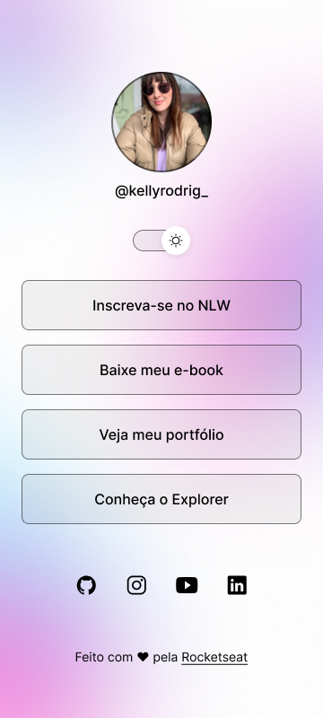

# Projeto de Perfil Pessoal

Este projeto é uma página de perfil pessoal que utiliza HTML, CSS e JavaScript. A página apresenta uma interface com modo claro e escuro, permitindo ao usuário alternar entre esses modos. Inclui links para redes sociais e um botão de alternância de temas.
Projeto que é como um cartão de visitas pessoal.

## Capturas de Tela

### Modo Escuro
 
### Modo Claro

## Funcionalidades

- **Alternância de Modo Claro e Escuro**: Um botão de alternância permite ao usuário mudar entre o modo claro e escuro.
- **Links de Navegação**: Links para LinkedIn, Instagram, GitHub e e-mail de contato.
- **Ícones Sociais**: Exibição de ícones de redes sociais no rodapé.
- **Design Responsivo**: Adaptação do layout para diferentes tamanhos de tela.

## Tecnologias Utilizadas

- **HTML**:
- **CSS**
- **JavaScript**
- **Figma**

## :memo: Licença

Esse projeto está sob a licença MIT.

Feito no curso da Rocketseat. ♥